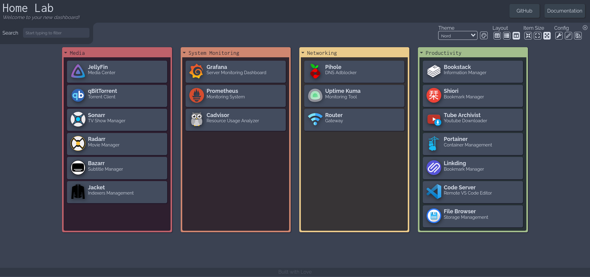

# My Homelab
 
Configurations and docker-compose files of my homelab



## Server Setup

- Install and setup debian: https://www.debian.org/distrib/netinst (amd64) (!! BOOT IN UEFI MODE !!)

- Install sudo `apt-get install sudo -y`

- Give your user permissions `usermod -aG sudo yourusername`

- Update interface with the following for static ip:

```
nano /etc/network/interfaces

# This file describes the network interfaces available on your system
# and how to activate them. For more information, see interfaces(5).

source /etc/network/interfaces.d/*

# The loopback network interface
auto lo
iface lo inet loopback

# The primary network interface
auto enp2s0
allow-hotplug enp2s0
iface enp2s0 inet static
address 192.168.0.26/24
gateway 192.168.0.1
```

- Delete dhcp by running `sudo apt-get remove isc-dhcp-client isc-dhcp-common`

- Add non free and contrib repos in `/etc/apt/sources.list` and run `sudo apt-get update`

- Install essential packages: `sudo apt-get install htop neofetch git build-essential `

- Install amd gpu drivers: ` sudo apt-get install firmware-amd-graphics libgl1-mesa-dri libglx-mesa0 mesa-vulkan-drivers lshw radeontop`

- Reboot after installing drivers. Run the followings to see if everything is fine:

```
sudo lshw -c video
find /dev -group video
modinfo -V radeon
lspci -nn | grep -E 'VGA|Display'
```

- Lastly run `sudo radeontop` to see usage stats

- Check followings if you stuck about setting up drivers:

```
https://github.com/jellyfin/jellyfin/issues/3927
https://jellyfin.org/docs/general/administration/hardware-acceleration.html
https://wiki.archlinux.org/title/Hardware_video_acceleration#ATI/AMD
```

- Docker installation:

```
sudo apt-get update

sudo apt-get install \
    ca-certificates \
    curl \
    gnupg \
    lsb-release

curl -fsSL https://download.docker.com/linux/debian/gpg | sudo gpg --dearmor -o /usr/share/keyrings/docker-archive-keyring.gpg

echo \
  "deb [arch=$(dpkg --print-architecture) signed-by=/usr/share/keyrings/docker-archive-keyring.gpg] https://download.docker.com/linux/debian \
  $(lsb_release -cs) stable" | sudo tee /etc/apt/sources.list.d/docker.list > /dev/null

sudo apt-get update

sudo apt-get install docker-ce docker-ce-cli containerd.io

sudo usermod -aG docker $USER
```

- Partition the HDD. Guides to follow:

```
https://www.tecmint.com/add-disk-larger-than-2tb-to-an-existing-linux/
https://nixcp.com/format-mount-disk-larger-2tb-linux/
```

- Change ownership of the /hdd: `sudo chown -R debian:debian /hdd`

- Add the following to `/etc/fstab`:

```
/dev/sda1 /hdd auto nosuid,nodev,nofail,x-gvfs-show 0 0
```

- Done! Add your services to portainer

## Docker and Portainer

- Portainer installation (checkout: official page for latest version):

```
docker volume create portainer_data

docker run -d -p 8000:8000 -p 9443:9443 --name portainer \
    --restart=always \
    -v /var/run/docker.sock:/var/run/docker.sock \
    -v portainer_data:/data \
    portainer/portainer-ce:2.11.1
```

- Add services as stack

- Change the default ip address in portainer

## Notes

- Qbittorrent: Make sure to set default torrent management mode to automatic
- Qbittorrent: Change the default ui on the web: `/config/VueTorrent`
- Qbittorrent: If required update the qbittorrent.conf with the following:

```
[BitTorrent]
Session\DisableAutoTMMTriggers\CategorySavePathChanged=false
Session\DisableAutoTMMByDefault=false
Session\DisableAutoTMMTriggers\CategoryChanged=false
Session\DisableAutoTMMTriggers\DefaultSavePathChanged=true
```
